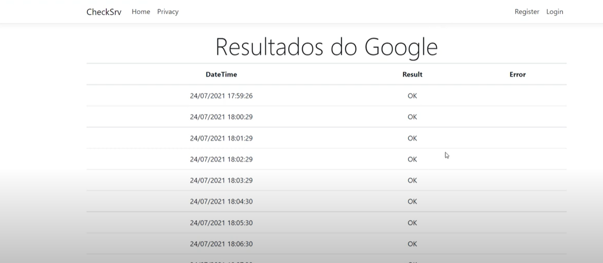

# Check-Service

_Autor:\
Marcius Bezerra\
[marciusbezerra@gmail.com](mailto:marciusbezerra@gmail.com)_

Aplicação simples, criada em ASP.NET Core MVC, que faz uso de um serviço que roda em background IHostedService para checar se um site ou serviço está no ar.
